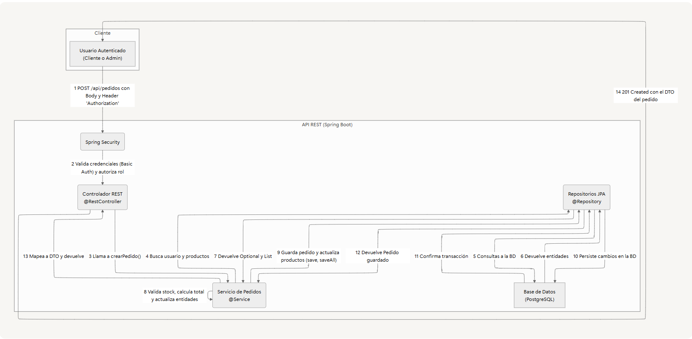

# **Sistema de E-commerce - API REST**

Una API REST robusta y escalable construida con Spring Boot para gestionar el inventario, los usuarios y los pedidos de un sistema de comercio electrónico. El proyecto está diseñado siguiendo una arquitectura por capas limpia, garantizando la mantenibilidad y la seguridad de las operaciones.

## **✨ Características Principales**

- **Seguridad Robusta Basada en Roles:** Utiliza Spring Security para asegurar los endpoints, implementando autenticación HTTP Basic y autorización a nivel de método con roles (`ADMIN`, `USER`).
- **Lógica de Negocio Transaccional:** El procesamiento de pedidos valida la disponibilidad de productos en tiempo real y actualiza el stock de forma atómica para garantizar la consistencia de los datos.
- **Gestión Completa de Entidades:** Proporciona operaciones CRUD completas y seguras para productos, y una gestión de pedidos y usuarios bien definida.
- **Arquitectura Limpia y Desacoplada:** Sigue una arquitectura en capas (controlador, servicio, repositorio) que promueve la mantenibilidad y la separación de responsabilidades.
- **Manejo de Errores Centralizado:** Un manejador de excepciones global (`@ControllerAdvice`) ofrece respuestas de error JSON consistentes y descriptivas para toda la API.

## **🏛️ Arquitectura del Sistema**

El siguiente diagrama ilustra el flujo de datos para la operación más crítica del sistema: la creación de un nuevo pedido.



## **🛠️ Tecnologías Utilizadas**

- **Lenguaje:** Java 17
- **Framework Principal:** Spring Boot 3
- **Seguridad:** Spring Security
- **Persistencia:** Spring Data JPA, Hibernate
- **Base de Datos:** PostgreSQL
- **Mapeo de Objetos:** MapStruct
- **Gestión de Dependencias:** Maven
- **Pruebas:** JUnit 5, Mockito
- **Utilidades:** Lombok

## **🚀 Cómo Empezar**

Sigue estos pasos para tener una copia del proyecto funcionando en tu máquina local.

### **Prerrequisitos**

- JDK 17 o superior.
- Apache Maven 3.9+
- Una instancia de PostgreSQL (versión 14+) corriendo.

### **Instalación**

1. **Clona el repositorio:**

    ```
    git clone https://github.com/tu-usuario/03-I-Sistema-de-Gestion-de-Inventario-y-Pedidos-para-E-commerce.git
    
    ```

2. **Navega al directorio del proyecto:**

    ```
    cd 03-I-Sistema-de-Gestion-de-Inventario-y-Pedidos-para-E-commerce
    
    ```

3. **Crea la base de datos en PostgreSQL:**

    ```
    CREATE DATABASE ecommerce_db;
    
    ```


## **⚙️ Configuración de Entorno**

El proyecto se configura a través del archivo `src/main/resources/application-dev.properties`.

La configuración principal que debes verificar y ajustar es la de la base de datos:

```
# src/main/resources/application-dev.properties

# Asegúrate de que estas credenciales coincidan con tu configuración local
spring.datasource.url=jdbc:postgresql://localhost:5432/ecommerce_db
spring.datasource.username={tu_usuario}
spring.datasource.password={tu_pw}

```

Al ejecutar con el perfil `dev`, se crearán automáticamente usuarios y productos de ejemplo.

## **🏃 Ejecución de la Aplicación**

- **Para ejecutar la aplicación en modo de desarrollo:**

    ```
    ./mvnw spring-boot:run
    
    ```

  La API estará disponible en `http://localhost:8080`.

- **Para construir el archivo JAR para producción:**

    ```
    ./mvnw clean package
    
    ```

  Luego puedes ejecutar el JAR con:

    ```
    java -jar target/ecommerce-0.0.1-SNAPSHOT.jar
    
    ```


## **🧪 Ejecución de las Pruebas**

Para ejecutar la suite de pruebas unitarias y de integración, utiliza el siguiente comando:

```
./mvnw test

```

## **📖 Documentación de la API**

### **Endpoints de Autenticación**

La base de la API se encuentra en `/api/autenticacion`.

| **Verbo** | **Endpoint** | **Seguridad** | **Descripción** |
| --- | --- | --- | --- |
| `POST` | `/registro` | `permitAll()` | Registra un nuevo usuario en el sistema. |
| `POST` | `/login` | `permitAll()` | Valida las credenciales de un usuario. |

### **Endpoints de Productos**

La base de la API se encuentra en `/api/productos`.

| **Verbo** | **Endpoint** | **Seguridad** | **Descripción** |
| --- | --- | --- | --- |
| `GET` | `/` | `hasAnyRole('ADMIN', 'USER')` | Obtiene una lista paginada de todos los productos. |
| `GET` | `/{id}` | `hasAnyRole('ADMIN', 'USER')` | Obtiene un producto por su ID. |
| `POST` | `/` | `hasRole('ADMIN')` | Crea un nuevo producto. |
| `PUT` | `/{id}` | `hasRole('ADMIN')` | Actualiza un producto existente. |
| `DELETE` | `/{id}` | `hasRole('ADMIN')` | Elimina un producto. |

### **Endpoints de Pedidos**

La base de la API se encuentra en `/api/pedidos`.

| **Verbo** | **Endpoint** | **Seguridad** | **Descripción** |
| --- | --- | --- | --- |
| `POST` | `/` | `hasAnyRole('USER', 'ADMIN')` | Crea un nuevo pedido. |
| `GET` | `/` | `hasRole('ADMIN')` | Obtiene una lista paginada de todos los pedidos. |
| `GET` | `/{id}` | `hasRole('ADMIN')` o propietario | Obtiene un pedido por su ID. |
| `GET` | `/usuario/{usuarioId}` | `hasRole('ADMIN')` o propietario | Obtiene los pedidos de un usuario específico. |